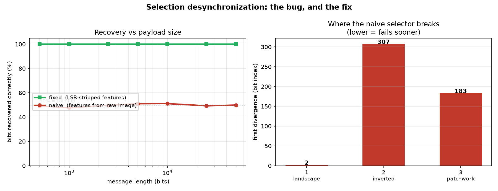
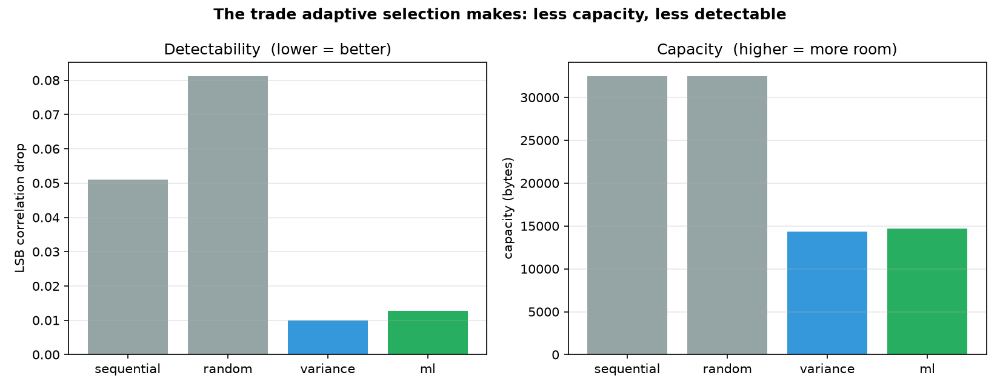

# Adaptive LSB Steganography

[](https://github.com/Abhinav-tech-crypto/steganography/actions/workflows/tests.yml)
[](LICENSE)

Hide a text message inside a PNG by tweaking the least significant bit of
selected pixels. A Random Forest picks *which* pixels, preferring busy,
textured regions where a flipped bit does not show.

The interesting part of this project is not the machine learning. It is a
synchronization bug that this design walks straight into, and the fix for
it. That story is in [How it works](#how-it-works).

```bash
pip install -r requirements.txt
export PYTHONPATH=src                 # Windows: set PYTHONPATH=src

python experiments/make_images.py                    # make 3 test covers
python -m stego.cli train "images/*.png"             # build model.pkl
python -m stego.cli hide -i images/cover1_landscape.png \
                         -o secret.png -m "meeting at 7pm"
python -m stego.cli reveal -i secret.png
```

```
meeting at 7pm
```

Every command above is executed by `tests/test_cli.py`, so the docs cannot
drift away from the code.

### With Docker

No Python setup needed. The image generates covers, trains a model and
runs the test suite during the build, so a successful build is itself
proof that the round-trip works.

```bash
docker build -t stego .
docker run --rm stego selftest -i images/cover1_landscape.png
docker run --rm stego capacity -i images/cover1_landscape.png
```

To work with your own images, mount a directory:

```bash
docker run --rm -v "$PWD/pics:/data" stego \
    hide -i /data/photo.png -o /data/secret.png -m "meeting at 7pm"
docker run --rm -v "$PWD/pics:/data" stego reveal -i /data/secret.png
```

---

## Contents

- [What it does](#what-it-does)
- [How it works](#how-it-works)
  - [1. LSB embedding](#1-lsb-embedding)
  - [2. Choosing pixels](#2-choosing-pixels)
  - [3. The synchronization problem](#3-the-synchronization-problem)
  - [4. The fix](#4-the-fix)
- [Every file, explained](#every-file-explained)
- [Results](#results)
- [What this is not](#what-this-is-not)

---

## What it does

| Command | Purpose |
|---|---|
| `train` | Fit the pixel-selection model on your own images |
| `hide` | Embed a UTF-8 message into a PNG |
| `reveal` | Extract it back out |
| `capacity` | How many bytes fit in a given image |
| `analyze` | Run steganalysis on an image (is something hidden?) |
| `selftest` | Hide + reveal once, to check the install works |

Lossless formats only. `hide` refuses to write `.jpg` — JPEG throws away
exactly the detail we hide in, so it would destroy the message silently.
An error beats a file that looks fine and decodes to garbage.

---

## How it works

### 1. LSB embedding

A pixel channel is a byte, `0..255`. Changing its lowest bit changes the
value by 1 — invisible to the eye, and one bit of storage.

```
original :  10110100   (180)
bit to hide:        1
result   :  10110101   (181)   <- indistinguishable on screen
```

Do that across many pixels and you have a message. The whole file is
`(pixel & 0xFE) | bit` plus a lot of care about *which* pixels.

### 2. Choosing pixels

Flipping a bit in a flat blue sky is comparatively easy to spot: the LSB
plane there is smooth, and a single flipped bit breaks that smoothness.
In a textured region — leaves, gravel, fabric — the low bits already look
random, so a change hides in existing noise.

So we score every pixel on three features (`features.py`):

- **variance** in a 3×3 neighbourhood — local busyness
- **edge strength** via `|Laplacian|` — is this a boundary?
- **brightness** — mid-tones tolerate change better than blown-out white

A Random Forest turns those into a keep/skip decision (`selector.py`,
`training.py`). Trained on the three synthetic covers:

```
training samples         : 120,000
baseline (variance>91.9) : 0.9872
random forest            : 0.9943
gain from ML             : +0.0071
feature importance       : brightness=0.021, variance=0.578, edge=0.401
```

Read that honestly: a one-line variance threshold already gets 98.7%. The
forest adds 0.7 points. Variance and edge do all the work; brightness is
nearly irrelevant. The ML is a reasonable way to combine three features,
not a breakthrough.

### 3. The synchronization problem

Here is the bug at the heart of adaptive LSB, and it is worth
understanding because it is invisible in small tests.

The sender picks pixels by looking at the cover image. The receiver only
ever sees the **stego** image. So the receiver must recompute the same
pixel list from *different data* — because embedding changed the pixels.

And the features are computed *from those pixel values*:

```
sender   : variance of original neighbourhood -> "keep pixel 4102"
embedding: pixel 4102 and its neighbours shift by ±1
receiver : variance of MODIFIED neighbourhood -> "skip pixel 4102"
```

One disagreement and every subsequent bit is read from the wrong pixel.
The message does not degrade gracefully, it turns to noise.

Measured (`experiments/exp1_desync.py`), naive selection on
`cover3_patchwork.png`:

```
naive : diverges at index 183
fixed : never diverges

  payload | naive bits  decodes | fixed bits  decodes
  --------------------------------------------------------
      500 |     49.1%    False |    100.0%     True
    5,000 |     51.0%    False |    100.0%     True
   50,000 |     49.9%    False |    100.0%     True
```

49–51% bit accuracy is a coin flip. The receiver is reading noise.



### 4. The fix

Select pixels from data that embedding **cannot change**.

We build the features from bit-planes 1–7 of each channel, ignoring bit 0
entirely — the only bit we ever write:

```python
stable = pixels & 0xFE     # drop the LSB before scoring
```

The sender scores `cover & 0xFE`. The receiver scores `stego & 0xFE`.
Embedding only ever touches bit 0, so **those two arrays are identical**,
and both sides derive the same pixel list. No coordination, no side
channel, no header listing the pixels.

The cost is real and worth stating: throwing away bit 0 slightly blurs the
features, so the selection is marginally worse than an oracle that could
see the true pixel values. In exchange, the scheme works at all. That
trade is the project.

`tests/test_sync.py` asserts both halves of this: the naive selector
provably desyncs, and the stable one provably does not.

---

## Every file, explained

### `src/stego/`

**`features.py`** — the three per-pixel features. One function,
`extract(img)`, returning an `(N, 3)` float array. Uses `& 0xFE` masking,
which is the whole synchronization fix in one line. Vectorized with numpy;
no Python loop over pixels.

**`selector.py`** — decides which pixel indices carry bits. Four
implementations behind one interface, so experiments can compare them:
`SequentialSelector` (every pixel in order), `RandomSelector` (shuffled by
a seed), `VarianceSelector` (threshold on local variance), `MLSelector`
(the Random Forest). Also `NaiveMLSelector`, which deliberately skips the
masking so `test_sync.py` can demonstrate the bug.

**`payload.py`** — message framing. Encodes the message as UTF-8, prefixes
a 32-bit big-endian length, then writes bits. The length header is why
`reveal` knows when to stop instead of returning 15 KB of trailing
garbage. UTF-8 (not `ord()` per character) is why Devanagari, CJK and
emoji survive intact.

**`core.py`** — `hide`, `reveal`, `capacity_bytes`. Thin: get indices from
a selector, get bits from the payload, write them. Raises if the message
is larger than capacity rather than truncating.

**`training.py`** — builds the training set and fits the forest. Labels
come from a variance/edge criterion, so the model is learning to
*approximate that judgement* from stable features. It also computes and
prints the one-line baseline for comparison, which is how the "+0.0071"
number above is produced. Reports honestly rather than flattering itself.

**`detect.py`** — steganalysis. LSB-plane correlation, LSB entropy, and a
chi-square test. Notably, entropy reads ~1.0 for both clean and stego
images here, and the file says so in a comment: it is near-useless on its
own. Correlation is the informative one.

**`synth.py`** — generates the three cover images. Lives in the package,
not in `experiments/`, so tests and experiments use byte-identical covers.
Three layouts (`landscape`, `inverted`, `patchwork`) with smooth regions
*and* textured regions, because a uniformly noisy image would make every
selector look equally good and hide the effect we are measuring.

**`cli.py`** — argument parsing and printing, nothing else. Includes
`force_utf8_output()`, which reconfigures stdout to UTF-8: on a Windows
console (cp1252 here) `print()` crashes on Devanagari even though the
message was recovered perfectly. Miserable bug, three-line fix.

### `tests/` — 30 tests, 3.5s

**`test_sync.py`** — the important one. Proves the naive selector desyncs
and the stable selector does not, across sizes and layouts.
**`test_roundtrip.py`** — hide/reveal for all four selectors, empty
message, capacity limits, near-full payloads.
**`test_unicode.py`** — Devanagari, CJK, emoji, mixed scripts.
**`test_cli.py`** — runs every command in this README.

### `experiments/`

**`exp1_desync.py`** — produces the divergence table above and
`results/desync_curve.png`.
**`exp2_compare.py`** — PSNR, detectability and capacity for all four
selectors; writes `results/comparison.csv` and `.png`.
**`make_images.py`** — writes `synth.py`'s covers to `images/`.

---

## Results

Averaged over the three covers (`experiments/exp2_compare.py`):

| selector | PSNR dB | corr drop ↓ | capacity |
|---|---|---|---|
| sequential | 62.53 | 0.0510 | 32,504 |
| random | 62.53 | 0.0813 | 32,504 |
| **variance** | 62.52 | **0.0100** | 14,373 |
| ml | 62.52 | 0.0127 | 14,676 |

"corr drop" is how much the embedding disturbs LSB-plane correlation —
lower is harder to detect.



Two things this table says, and one it does not:

- Adaptive selection genuinely beats naive order: `ml` disturbs the LSB
  plane **4× less** than `sequential` (0.0127 vs 0.0510).
- It costs capacity. Being picky means using fewer than half the pixels:
  ~14.4 KB instead of ~32.5 KB.
- **The forest does not beat the variance threshold** (0.0127 vs 0.0100 —
  slightly worse). On these three synthetic images, the one-line heuristic
  wins.

So the honest summary: the ML is not what makes this work. The
synchronization fix is. A tuned number would look better in a report and
would be a lie.

---

## What this is not

**Not encryption.** Steganography hides *that* a message exists; it does
not protect the contents. Anyone who knows the scheme and has the model
can read it. Encrypt first if the content matters.

**Not robust to re-encoding.** Save as JPEG, resize, or screenshot the
stego image and the message is gone. `hide` refuses JPEG output for
exactly this reason, but it cannot stop what happens to the file later.

**Not evaluated against a real steganalyzer.** `detect.py` implements
classic statistical tests. A modern CNN-based detector (SRNet and
relatives) would very likely flag these images. "Harder to detect than
sequential LSB" is the claim, not "undetectable".

**Model files are not committed.** `joblib.load()` on an untrusted pickle
executes arbitrary code, and a model is a build artifact. Run `train` and
make your own — it takes a few seconds.
